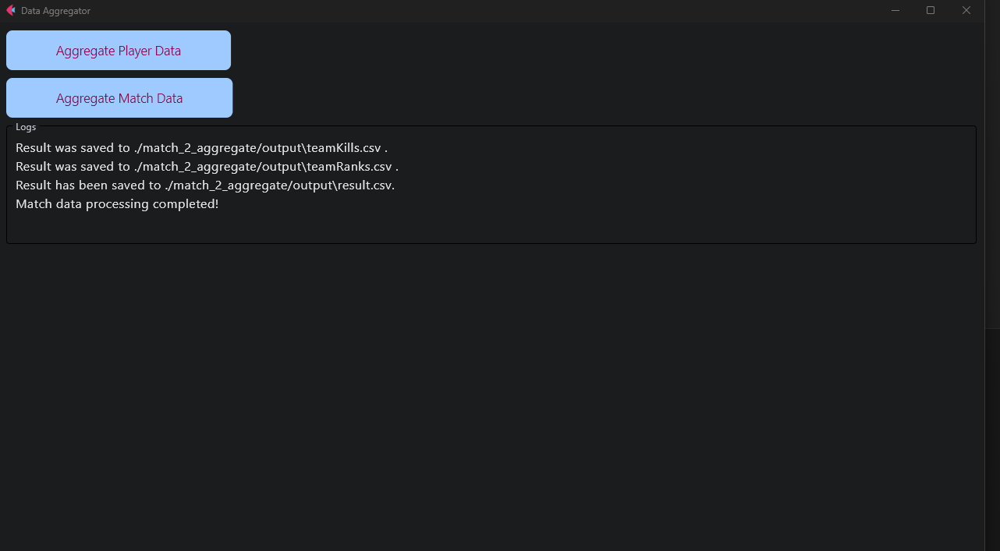

# simple-ApexLegends-analytics-using-liveapi
this is a simple tool using python with json file created by Apex Legends liveapi 

ApexLegendsのliveapiから出力されるjsonファイルを利用してマッチ戦績、プレイヤー戦績の分析を行います。

# Usage

1.Add `+cl_liveapi_enabled 1 ` to your boot option in Apex

`+cl_liveapi_enabled 1 `をsteamなどの起動オプションに追加してください。

2.Start an Apex Custom Match  

カスタムマッチのオブザーバーでないとjsonファイルが生成されません。

3.Find json file in your computer(often found in `"C:\Users\hogehoge(your user name)\Saved Games\Respawn\Apex\assets\temp\live_api"`)  

パソコンのユーザーネームが'田中'であれば、`"C:\Users\田中\Saved Games\Respawn\Apex\assets\temp\live_api"`というパスにjsonファイルが保存されます。

4.Move json files you want to analyze to the folder `raw_data` and `match_2_aggregate` .

分析したいプレイヤーデータは`raw_data`に、`match_2_aggregate`には、例えば、一回のカスタムマッチで6回の試合をしたその6回分のjsonファイルを入れてください。

5.Run code/exec

コードを実行するか、exeを実行してください。

6. Csv file will pop.

`players_stats.csv`がexeと同じ階層に、`result.csv`が`match_2_aggregate/output`に生成されます。スプレッドシートに取り込むなどして活用してください。

Any advices, comments are welcomed.

# Example Spread Sheet

Below is the spradsheet link of the data collected in ANC 2023/4/8 - 2023/8/19

https://docs.google.com/spreadsheets/d/1GzRMKhm1AbHTjvfg4UPPQ5YVX1qP_rI3o-17IdjODPY/edit#gid=2041309235

# Road Map

- 安置データ分析

- websocketの活用

- update対応

- 可読性などの向上
